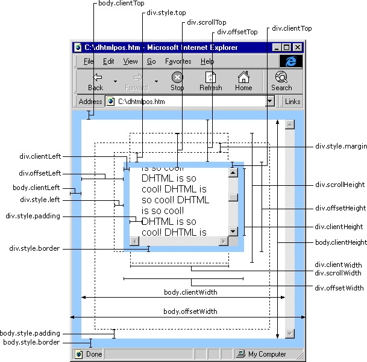

# HTML

## 主体结构元素

### article

- 代表文档、页面、或应用程序中独立的、完整的、可以被外部引用的内容。
- 可以是一篇博客或文章、论坛中的帖子、一段用户评论或独立的插件，或其他任意独立的内容。
- `<article>` 可以嵌套使用，内层的内容在原则上需要与外层的内容相关联。如一篇文章中，针对该文章的评论
- `<article>` 也可用来表示插件，使插件看起来像内嵌在页面中一样
- `<article>` 元素不能成为 `<address>` 元素的子元素
- `<article>` 是一种特殊的 `<section>` 它比 `<section>` 元素更强调独立性，`<section>` 元素强调分段或分块

```html
<article>
    <header>
        <h1>标题</h1>
        <p>段落</p>
        <p>发表日期： <time pubdate="pubdate">2018/3/25</time></p>
    </header>
    <p>内容</p>
    <section>
        <h2>评论</h2>
        <article>
            <header>
                <h3>发布者：炫</h3>
                <p>
                    <time pubdate="pubdate" datetime="2018-3-25T14:48">1小时前</time>
                </p>
            </header>
            <p>评论内容部分</p>
        </article>
        <article>
            <header>
                <h3>发布者：玲</h3>
                <p>
                    <time pubdate="pubdate" datetime="2018-3-25T12:30">3小时前</time>
                </p>
            </header>
            <p>评论内容部分</p>
        </article>
    </section>
    <footer>
        <p>底部内容</p>
        <p><small>著作权归我个人所有</small></p>
    </footer>
</article>
```

```hmtl
<article>
    <h1>插件嵌套</h1>
    <object data="" type="">
        <param name="name" value="true" />
        <embed src="#" type="" width="" height="" />
    </object>
</article>
```

### section

- `<section>` 表示文档中的一个区域（或节），比如，内容中的一个专题组，一般来说会有包含一个标题（heading）。一般通过是否包含一个标题 (`<h1>-<h6>` element) 作为子节点来辨识每一个 `<section>` 。
- 如果元素内容可以分为几个部分的话，应该使用 `<article>` 而不是 `<section>`，`<section>` 是对页面内容的分块。
- 不要把 `<section>` 元素作为一个普通的容器来使用，这是本应该是 `<div>` 的用法（特别是当片段（the sectioning ）仅仅是为了美化样式的时候）。 一般来说，一个 `<section>` 应该出现在文档大纲中。
- 一个 `<section>` 元素一定不能作为 `<address>` 元素的子节点。
- 如果 `<article> <aside> <nav>` 更符合条件，就不要使用 `<section>` 了。
- `<section>` 中包含的内容是可以单独的输出到 word 中或储存到数据库中

### nav

- `<nav>` 描绘一个含有多个超链接的区域，这个区域包含转到其他页面，或者页面内部其他部分的链接列表.
- 并不是所有的链接都必须使用 `<nav>` 元素,它只用来将一些热门的链接放入导航栏,例如 `<footer>` 元素就常用来在页面底部包含一个不常用到,没必要加入`<nav>` 的链接列表.
- 一个网页也可能含有多个 `<nav>` 元素,例如一个是网站内的导航列表,另一个是本页面内的导航列表.
- 对于屏幕阅读障碍的人,可以使用这个元素来确定是否忽略初始内容.
- 不要与 `<menu>` 元素进行混淆，`<menu>` 标签定义命令的列表或菜单。`<menu>` 标签用于上下文菜单、工具栏以及用于列出表单控件和命令。
- 使用场景
  - 传统导航条： 当前页面跳转到网站的其他主要页面中去
  - 侧边栏导航： 将页面从当前文章或当前商品跳转到其他文章或其他商品中去
  - 页内导航：本页面内的主要内容间进行跳转，如锚点目录
  - 翻页操作：多个页面的前后页，或前后篇文章滚动

### aside

- `<aside>` 元素表示一个和其余页面内容几乎无关的部分，被认为是独立于该内容的一部分并且可以被单独的拆分出来而不会使整体受影响。其通常表现为侧边栏或者嵌入内容。他们通常包含在工具条，例如来自词汇表的定义。也可能有其他类型的信息，例如相关的广告、笔者的传记、web 应用程序、个人资料信息，或在博客上的相关链接。
- 不要将 `<aside>` 元素去标记括号内的文本，因为这种类型的文本（即括号内的文本）被认为是其内容流的一部分。

### time

- 目前主流浏览器都不支持

## 非主体结构元素

### header

- `<header>` 元素表示一组引导性的帮助，可能包含标题元素，也可以包含其他元素，像 logo、分节头部、搜索表单等。
- `<header>` 元素不是分节内容，所以不会引入新的分节到大纲中。
- 注意 `<header>` 元素不能作为 `<address>`, `<footer>` 或其他 `<header>` 元素的子元素。
- 一个页面中不限制 `<header>` 的数量，可以为每一个内容区块添加一个 `<header>`
- 通常至少包含一个 `H` 标签

### hgroup

- 此元素已被删除

### footer

- `<footer>` 元素表示最近一个章节内容或者根节点（sectioning root ）元素的页脚。一个页脚通常包含该章节作者、版权数据或者与文档相关的链接等信息。
- `<footer>` 元素内的作者信息应包含在 `<address>` 元素中。
- `<footer>` 元素不是章节内容，因此在 outline 中不能包含新的章节。
- 注意 `<footer>`元素必须不能是 `<address>`, `<header>` 或者另一个 `<footer>` 元素的后代元素。

### address

- `<address>` 元素可以让作者为它最近的 `<article>` 或者 `<body>` 祖先元素提供联系信息。在后一种情况下，它应用于整个文档。
- 当表示一个和联系信息无关的任意的地址时，使用 `<p>` 元素而不是 `<address>` 元素。
- 这个元素不能包含除了联系信息之外的任何信息，比如出版日期（这应该包含在 `<time>` 元素中）
- 通常，`<address>` 元素可以放在当前 section 的 `<footer>` 元素中，如果存在的话。
- 子标签是不能是内嵌的 `<address>` 元素、heading content（`<hgroup>`、`<h1>`、`<h2>`、`<h3>`、`<h4>`、`<h5>`、`<h6>`）、sectioning content（`<article>`、`<aside>`, `<section>`、`<nav>`）、 `<header>` 或者 `<footer>` 元素

## HTML5 结构

### 显示排版

- 明确使用 `section` 等元素创建文档结构，在每个区块中使用标题
- 清晰、易读, 推荐使用

### 隐藏排版

- 不明确使用 `section` 等元素，根据页面中所书写的各级标题等把内容区块自动创建出来

## 字符实体

### 空格

|  字符实体  | 描述                               | 实体编号  |
| :--------: | ---------------------------------- | :-------: |
|  `&nbsp;`  | 不换行空格, No-Break Space         | `&#160;`  |
|  `&ensp;`  | 半角空格, En Space, 1em 宽度的 1/2 | `&#8194;` |
|  `&emsp;`  | 全角空格, Em Space, 1em 宽度       | `&#8195;` |
| `&thinsp;` | 窄空格, Thin Space, 1em 宽度的 1/6 | `&#8201;` |

## 不缓存页面内容

```html
    <meta http-equiv="Expires" content="0">
    <meta http-equiv="Pragma" content="no-cache">
    <meta http-equiv="Cache-control" content="no-cache">
    <meta http-equiv="Cache" content="no-cache">
```

## canvas

- canvas 生成图片时 `canvas.toDataURL`, canvas 中如果引用了跨域图片，无法生成
  - 将引入的图片转换成 base64 位图片再引入
  - 配置跨域



## 响应式网站字体大小设置 rem 方式

```js
(function (doc, win) {
    var docEl = doc.documentElement,
        resizeEvt = 'orientationchange' in window ? 'orientationchange' : 'resize',
        recalc = function () {
            var clientWidth = docEl.clientWidth;
            if (!clientWidth) return;
            if (clientWidth >= 750) {
                docEl.style.fontSize = '100px';
            } else {
                docEl.style.fontSize = 100 * (clientWidth / 750) + 'px';
            }
        };

    if (!doc.addEventListener) return;
    win.addEventListener(resizeEvt, recalc, false);
    doc.addEventListener('DOMContentLoaded', recalc, false);
})(document, window);
```

## HTML 自定义属性

- 以 `data-*` 开始, 可以在 DOM `dataset[*]` 对象中获取
- 不以 `data-` 开头，不会在 `dataset` 对象中

  ```html
    <p data-dimg="111" data-my-img="222" data-55-img="444" data-v-12="555" img="333" id="dp"></p>
    <script>
        dp.dataset.dimg // 111
        dp.dataset.myImg // 222
        dp.dataset['55Img'] // 444
        dp.dataset['v-12'] // 555
        dp.dataset.img // undeinfed
        dp.getAttribute('img') // 333

    </script>
  ```

- img 标签 src 属性
  - 以 `img.getAttribute('src')` 获取原始值 `/a.png`
  - 以 `img.src` 获取，获取绝对路径，`https://www.**.com/a.png`

## 规范

  1. html 属性顺序
     - `id`
     - `class`
     - `name`
     - `data-xxx`
     - `src for type href`
     - `title alt`
     - `aria-xxx role`
  2. html 嵌套规则
     - `h1~h6` 中不能嵌套 `div p ul ol`
     - `a` 中不能嵌套 `div`, 如果`a`的父级是`div`, 则可以嵌套 `div`
     - `p` 中不能嵌套 `<div>、<h1>~<h6>、<p>、<ul>/<ol>/<li>、<dl>/<dt>/<dd>、<form>等`
     - `a` 中不能嵌套交互元素, 如: `a， audio（如果设置了controls属性）， button， details， embed， iframe， img（如果设置了usemap属性）， input（如果type属性不为hidden状态）， keygen， label， menu（如果type属性为toolbar状态），object（如果设置了usemap属性）， select， textarea， video（如果设置了controls属性）`
     - 列表元素中不能嵌套非列表元素
     - `inline-Level` 元素，仅可以包含文本或其它 `inline-Level` 元素;
  3. head  

      ```html
      <!-- 中文 -->
      <html lang="zh-Hans">

      <!-- 简体中文 -->
      <html lang="zh-cmn-Hans">

      <!-- 繁体中文 -->
      <html lang="zh-cmn-Hant">

      <!-- English -->
      <html lang="en">

       <meta charset="utf-8">

       <meta http-equiv="X-UA-Compatible" content="IE=edge,chrome=1">

        <!-- SEO -->
           <title>Style Guide</title>
           <meta name="keywords" content="your keywords">
           <meta name="description" content="不超过150个字符">
           <meta name="author" content="author,email address">
        <!-- ios图标 -->
          <link rel="apple-touch-icon" sizes="57x57" href="touch-icon-iphone.png" />
          <link rel="apple-touch-icon" sizes="72x72" href="touch-icon-ipad.png" />
          <link rel="apple-touch-icon" sizes="114x114" href="touch-icon-iphone4.png" />
          <link rel="apple-touch-icon" sizes="144x144" href="apple-touch-icon-ipad3-144.png" />

          <!-- iPhone 和 iTouch，默认 57x57 像素，必须有 -->
          <link rel="apple-touch-icon-precomposed" href="/apple-touch-icon-57x57-precomposed.png">

          <!-- iPad，72x72 像素，可以没有，但推荐有 -->
          <link rel="apple-touch-icon-precomposed" href="/apple-touch-icon-72x72-precomposed.png" sizes="72x72">

          <!-- Retina iPhone 和 Retina iTouch，114x114 像素，可以没有，但推荐有 -->
          <link rel="apple-touch-icon-precomposed" href="/apple-touch-icon-114x114-precomposed.png" sizes="114x114">

          <!-- Retina iPad，144x144 像素，可以没有，但推荐有 -->
          <link rel="apple-touch-icon-precomposed" href="/apple-touch-icon-144x144-precomposed.png"   sizes="144x144">
      ```
