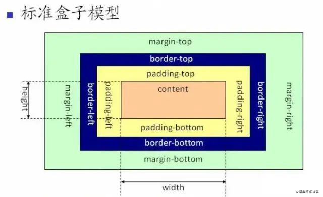
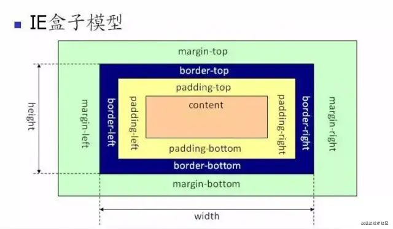

# css

## 图层

一般来说，可以把普通文档流看成一个图层。特定的属性可以生成一个新的图层。**不同的图层渲染互不影响**，所以对于某些频繁需要渲染的建议单独生成一个新图层，提高性能。**但也不能生成过多的图层，会引起反作用。**

通过以下几个常用属性可以生成新图层

+ 3D 变换：`translate3d`、`translateZ`
+ [`will-change`](https://developer.mozilla.org/zh-CN/docs/Web/CSS/will-change): `.sidebar { will-change: transform; }`
+ `video`、`iframe` 标签
+ 通过动画实现的 `opacity` 动画转换
+ `position: fixed`

## 重绘（Repaint）和回流（Reflow）

重绘和回流是渲染步骤中的一小节，但是这两个步骤对于性能影响很大。

+ 重绘是当节点需要更改外观而不会影响布局的，比如改变 `color` 就叫称为重绘
+ 回流是布局或者几何属性需要改变就称为回流。

回流必定会发生重绘，重绘不一定会引发回流。回流所需的成本比重绘高的多，改变深层次的节点很可能导致父节点的一系列回流。

所以以下几个动作可能会导致性能问题：

+ 改变 window 大小
+ 改变字体
+ 添加或删除节点
+ 文字改变
+ 定位或者浮动
+ 盒模型

很多人不知道的是，重绘和回流其实和 Event loop 有关。

1. 当 Event loop 执行完 Microtasks 后，会判断 document 是否需要更新。因为浏览器是 60Hz 的刷新率，每 16ms 才会更新一次。
2. 然后判断是否有 `resize` 或者 `scroll` ，有的话会去触发事件，所以 `resize` 和 `scroll` 事件也是至少 16ms 才会触发一次，并且自带节流功能。
3. 判断是否触发了 media query
4. 更新动画并且发送事件
5. 判断是否有全屏操作事件
6. 执行 `requestAnimationFrame` 回调
7. 执行 `IntersectionObserver` 回调，该方法用于判断元素是否可见，可以用于懒加载上，但是兼容性不好
8. 更新界面
9. 以上就是一帧中可能会做的事情。如果在一帧中有空闲时间，就会去执行 `requestIdleCallback` 回调。

## 减少重绘和回流

+ 使用 `translate` 替代 `top`

  ```html
  <div class="test"></div>
  <style>
   .test {
    position: absolute;
    top: 10px;
    width: 100px;
    height: 100px;
    background: red;
   }
  </style>
  <script>
   setTimeout(() => {
          // 引起回流
    document.querySelector('.test').style.top = '100px'
   }, 1000)
  </script>
  ```

+ 使用 `visibility` 替换 `display: none` ，因为前者只会引起重绘，后者会引发回流（改变了布局）

+ 把 DOM 离线后修改，比如：先把 DOM 给 `display:none` (有一次 Reflow)，然后你修改100次，然后再把它显示出来

+ 不要把 DOM 结点的属性值放在一个循环里当成循环里的变量

  ```js
  for(let i = 0; i < 1000; i++) {
      // 获取 offsetTop 会导致回流，因为需要去获取正确的值
      console.log(document.querySelector('.test').style.offsetTop)
  }
  ```

+ 不要使用 table 布局，可能很小的一个小改动会造成整个 table 的重新布局

+ 动画实现的速度的选择，动画速度越快，回流次数越多，也可以选择使用 `requestAnimationFrame`

+ CSS 选择符从右往左匹配查找，避免 DOM 深度过深

+ 将频繁运行的动画变为图层，图层能够阻止该节点回流影响别的元素。比如对于 `video` 标签，浏览器会自动将该节点变为图层。

## 盒模型

> css {box-sizing: content-box|border-box|inherit;}  
> conent + padding + border + margin

### content-box

+ W3C 标准盒模型
+ ElementWidth = width + border + padding
+ 

### border-box

+ IE 盒模型
+ ElementWidth = width
+ 

## BFC

> 块级格式化上下文，它是一块独立的渲染区域，只有Blcok-level box(块级盒) 参与，它规定了内部的Blcok-level box如何布局，并且内部元素的渲染和外界互不影响

### 元素满足下面任一条件就会形成BFC

+ body根元素
+ 浮动元素：float 的值不是none
+ 绝对定位元素 position是 absolute | fixed
+ display的值为 inline-block | flex | inline-flex | table-cell | table-caption
+ overflow的值不是visible

### BFC的特征（布局规则）

+ 在一个BFC中，行盒（行盒由一行中所有的内联元素所组成，直到当行被占满然后换行）与块盒（块盒会被渲染为完整的一个新行，除非另外指定）都会垂直的沿着其父元素的边框排列
+ Box垂直方向的距离由margin决定。属于同一个BFC的两个相邻Box的margin会发生重叠, 浮动元素的margin不会重叠
+ 每个盒子（块盒与行盒）的margin box的左边，与包含块border box的左边相接触(对于从左往右的格式化，否则相反)。即使存在浮动也是如此。
+ BFC的区域不会与float box重叠。
+ BFC就是页面上的一个隔离的独立容器，容器里面的子元素不会影响到外面的元素。反之也如此。
+ 计算BFC的高度时，浮动元素也参与计算。

## 滚动条样式更改

### IE下的滚动条样式

+ scrollbar-arrow-color: color; /三角箭头的颜色/  
+ scrollbar-face-color: color; /立体滚动条的颜色（包括箭头部分的背景色）/  
+ scrollbar-3dlight-color: color; /立体滚动条亮边的颜色/  
+ scrollbar-highlight-color: color; /滚动条的高亮颜色（左阴影？）/  
+ scrollbar-shadow-color: color; /立体滚动条阴影的颜色/  
+ scrollbar-darkshadow-color: color; /立体滚动条外阴影的颜色/  
+ scrollbar-track-color: color; /立体滚动条背景颜色/
+ scrollbar-base-color:color; /滚动条的基色/

### webkit的自定义滚动条样式

+ ::-webkit-scrollbar 滚动条整体部分  
+ ::-webkit-scrollbar-button 滚动条两端的按钮
+ ::-webkit-scrollbar-track 外层轨道
+ ::-webkit-scrollbar-track-piece 内层轨道，滚动条中间部分（除去）
+ ::-webkit-scrollbar-thumb （拖动条？滑块？滚动条里面可以拖动的那个，肿么翻译好呢？）
+ ::-webkit-scrollbar-corner 边角
+ ::-webkit-resizer 定义右下角拖动块的样式

    ```css
    /* 滚动条部分 */
    ::-webkit-scrollbar {
        width:15px;
    }

    /* 轨道 */
    ::-webkit-scrollbar-track {
        -webkit-box-shadow: inset 0 0 6px rgba(0,0,0,0.3); 
        -webkit-border-radius: 15px;
        border-radius: 15px;
    }

    /* 手柄 */
    ::-webkit-scrollbar-thumb {
        -webkit-border-radius: 15px;
        border-radius: 15px;
        background:rgba(200,200,200,0.7);
        -webkit-box-shadow: inset 0 0 6px rgba(0,0,0,0.5);
    }
    /* 手柄激活态 */
    ::-webkit-scrollbar-thumb:window-inactive {
        background: rgba(200,200,200,0.4);
    }
    ```

## 多选文本溢出省略

```css
 /* 一行文本溢出 */
 overflow: hidden;
 text-overflow: ellipsis;
 white-space: nowrap;

 /* 多行文本溢出 - webkit */
 display: -webkit-box;
 -webkit-box-orient: vertical;
 -webkit-line-clamp: 3;
 overflow: hidden;

 /* 多行文本溢出 line-heigt 多用 em */
 p{
  position: relative;
  line-height: 2em;  
  max-height: 40px;
  overflow: hidden;
 }
 p::after{
  content: "...";
  position: absolute;
  bottom: 0;
  right: 0;
  padding-left: 40px;
  background: -webkit-linear-gradient(left, transparent, #fff 55%);
  background: -o-linear-gradient(right, transparent, #fff 55%);
  background: -moz-linear-gradient(right, transparent, #fff 55%);
  background: linear-gradient(to right, transparent, #fff 55%);
 }
```

```js
 // 插件 [Clamp.js](https://github.com/josephschmitt/Clamp.js)
  var module = document.getElementById("clamp-this-module");
  $clamp(module, {clamp: 3});
  
  
 // 插件 [-jQuery.dotdotdot](https://github.com/BeSite/jQuery.dotdotdot)
  $(document).ready(function() {
    $("#wrapper").dotdotdot({
    //configuration goes here
  });
});
```

## 双击取消选种

```css
 div{
    -moz-user-select:none;/*火狐*/
    -webkit-user-select:none;/*webkit浏览器*/
    -ms-user-select:none;/*IE10*/
    -khtml-user-select:none;/*早期浏览器*/
    user-select:none;
 }
```

## 拨打电话

```html

拨打电话/发送短息/邮箱
 <a href="tel:13764567708">移动WEB页面JS一键拨打号码咨询功能</a>
 <a href="sms:13764567708">移动WEB页面JS一键发送短信咨询功能</a>
 <a href="mailto:bd@pangxiekeji.com">bd@pangxiekeji.com</a>
 <a href="Mailto:ghsau@163.com?CC=ghsau@163.com&BCC=ghsau@163.com&Subject=Hello&Body=你好">给我发邮件</a>  
 参数说明：
        CC：抄送地址；

        BCC：密件抄送地址；

        Subject：主题；

        Body：邮件内容。

        注：多个邮件地址用";"隔开。


使用wtai协议进行拨打电话。
<a href="wtai://wp//mc;13764567708">拨打10086 </a>  
<a href="wtai://wp/ap;13764567708;">将10086存储至电话簿 </a>

手机端唤醒微信
<a href="weixin://">打开微信</a>

QQ:
<a target="_blank" href="http://wpa.qq.com/msgrd?v=3&uin=892131064&site=qq&menu=yes"></a>

移动web页面自动探测电话号码
<meta name="format-detection" content="telephone=no">
<meta http-equiv="x-rim-auto-match" content="none">

```

## 最小字体

浏览器最小字体大小为 12px (用户可能过浏览器调整，edge 最小可以设置成6px;移动端 safari 最小可以显示1px)  
使用 `transform: scale()` 缩放让字体小于 12px

## `line-height` `1.5` `1.5em` `150%` 之间的区别

> `font-size` `line-height` 是可以继承下去的  
> 这是一个关于继承的区别  
> `line-height: 1.5rem` 相对于 html 字体大小，想当于设置了 `1.5 * html字体大小`  

+ 如果元素自身设置了 `line-height`（如此元素 `font-size: 20px`）
  + `line-height: 1.5/150%/1.5em` 是一样的，没有区别，结果都是 `line-height: 30px`
+ 如果 元素A 自身没有设置 `line-height`, 但它的父元素（字体大小为`20px`）设置如下
  + `line-height: 150%`：继承父元素的行高，`20px * 150% = 30px` 无论 A 是字体多大, 行高始终是 `30px`
  + `line-height: 1.5em`: 同上
  + `line-height: 1.5`: 受自己字体大小影响，行高为 `1.5 * 元素自身字体大小`

## rem 与 em

`rem` 相对于 `html` 元素设置字体大小计算，不是 `body`, 如果 html 未明确声明字体大小，采用默认值 `16px`(新edge字体大小, 可在浏览器中自己设置)  
如果当前元素设置了 `font-size: 16px` 则当前元素中的 `em` 取自身 `font-size` 大小， 如果未设置，取父元素 `font-size` 大小

## css 实现一个正方形

> 1、`padding` 百分比相对**父元素宽度**计算  `margin` 也是  
> 2、给固定宽高 `vw` `vmin` `vmax` `px` `rem` `em`  
> 3、JS 计算

```html
<div class="outer">
  <div class="inner"></div>
</div>
<style>
  /*方法一*/
  .outer {
    width: 500px;
    height: 500px;
    background: #333;
  }
  .inner {
    box-sizing: border-box;
    width: 50%;
    padding: 25%; /* padding百分比相对父元素宽度计算 */
    background-color: #999;
  }

  /*方法二*/
  .outer {
    width: 500px;
    height: 500px;
  }
  .inner {
    width: 50%;
    padding-bottom: 50%;
    height: 0; /*避免被内容撑开多余高度*/
  }
</style>
```

## sass

```css

compact
 /*命令行内容*/
sass style.scss:style.css --style compact

/*编译过后样式*/
.box { width: 300px; height: 400px; }
.box-title { height: 30px; line-height: 30px; }

compressed
/*命令行内容*/
sass style.scss:style.css --style compressed

/*编译过后样式*/
.box{width:300px;height:400px}.box-title{height:30px;line-height:30px}

expanded
/*命令行内容*/
sass style.scss:style.css --style expanded

/*编译过后样式*/
.box {
  width: 300px;
  height: 400px;
}
.box-title {
  height: 30px;
  line-height: 30px;
}


nested
/*命令行内容*/
sass style.scss:style.css --style nested

/*编译过后样式*/
.box {
  width: 300px;
  height: 400px; }
  .box-title {
    height: 30px;
    line-height: 30px; }
```

### scss 样式

```scss
// 使用 , 分格数组
// 如果  10 15, 20 25 则会生成 margin-left-10 15 {margin-left: 10 15px}
@each $size in 10, 15, 20, 25 {
  @each $style in margin padding {
    @each $position in left, top, bottom, right {
      .#{$style}-#{$position}-#{$size} {
        #{$style}-#{$position}: $size + px;
      }
    }
    .#{$style}-#{$size} {
      #{$style}: $size + px;
    }
  }
}
// 编译结果 marin padding left top bottom 循环
.margin-left-10 {
  margin-left: 10px;
}
.margin-10 {
  margin: 10px;
}
```

## textarea

```css
1：彻底禁用拖动（推荐）
resize: none;

2：只是固定大小，右下角的拖动图标仍在
width: 200px;
height: 100px;
max-width: 200px;
max-height: 100px;
```

## 去除移动端选种背景

```css
body{ -webkit-tap-highlight-color:rgba(0,0,0,0); }

a:focus,
input:focus,
p:focus,
div:focus {
    -webkit-tap-highlight-color: rgba(0,0,0,0);
    -webkit-user-modify: read-write-plaintext-only;
}

/* 使用图片作为a标签的点击按钮时，当触发touchstart的时候，往往会有一个灰色的背景 */
a,a:hover,a:active,a:visited,a:link,a:focus{
    -webkit-tap-highlight-color:rgba(0,0,0,0);
    -webkit-tap-highlight-color: transparent;
    outline:none;
    background: none;
    text-decoration: none;
}

/* 取消a标签在移动端点击时的蓝色 */
-webkit-tap-highlight-color: rgba(255, 255, 255, 0);
-webkit-user-select: none;
-moz-user-focus: none;
-moz-user-select: none;
```

## 去除select默认样式

```css
select {
/*Chrome和Firefox里面的边框是不一样的，所以复写了一下*/
border: solid 1px #000;
/*很关键：将默认的select选择框样式清除*/
appearance:none;
-moz-appearance:none;
-webkit-appearance:none;
/*将背景改为红色*/
background:red;
/*加padding防止文字覆盖*/
padding-right: 14px;
}
/*清除ie的默认选择框样式清除，隐藏下拉箭头*/
select::-ms-expand { display: none; }
```

## 清除 input 样式

```css
/* 去除搜索后的 X */
input[type="search"]::-webkit-search-cancel-button {
      -webkit-appearance: none;
      display: none;
}
input {
  appearance: none;
}
```

## placeholder样式重置

```css
input::-webkit-input-placeholder, textarea::-webkit-input-placeholder {
color: #fff;
}
input:-moz-placeholder, textarea:-moz-placeholder {
color: #fff;
}
input::-moz-placeholder, textarea::-moz-placeholder {
color: #fff;
}
input:-ms-input-placeholder, textarea:-ms-input-placeholder {
color: #fff;
}
```

## 伪类的使用

```scss
ul{
  counter-reset: cont; // 定义一个计数器 cont 计数器从 0 开始
   li{
    counter-increment: cont; // cont 递增 1
    &::before{  
        content: "0"counter(item);  // 显示 01
    }
   }
}

```

```html
<p class="att" data-name="aaa">aaa</p>
<style>
    .att::before{
        content: attr(data-name); /* 显示 aaa*/
    }
</style>

```

## flex中的多行文本上下居中

+ 多行文本居中的方式
+ table-cell
+ line-height + padding
+ transform + position
+ button

```html
    <h2>多行文本</h2>
    <style>
      h2{
        display:flex;
        flex-direction: column;
        justify-content: center;
      }
    </style>
```

## 滚动条平滑滚动

```css

body,html {
   scroll-behavior: smooth;
}
.container {
   scroll-behavior: smooth;
}
```

## 规范

+ 页面中尽量不要引入超过两个样式表
+ 待办事项用 `todo` 注释, 尽量不用模块注释
+ 声明顺序
  + Positioning 定位

    ```css
     /* Positioning */
      position: absolute;
      top: 0;
      right: 0;
      bottom: 0;
      left: 0;
      z-index: 100;
    ```

  + Box model 盒模型

    ```css
    /* Box model */
      display: block;
      box-sizing: border-box;
      width: 100px;
      height: 100px;
      padding: 10px;
      border: 1px solid #e5e5e5;
      border-radius: 3px;
      margin: 10px;
      float: right;
      overflow: hidden;
    ```

  + Typographic 排版

    ```css
    /* Typographic */
      font: normal 13px "Helvetica Neue", sans-serif;
      line-height: 1.5;
      text-align: center;
    ```

  + Visual 视觉效果

    ```css
    /* Visual */
      background-color: #f5f5f5;
      color: #fff;
      opacity: .8;

    ```

  + 其它

    ```css
    /* Other */
      cursor: pointer;
    ```

## 样式继承

> CSS `all` 简写属性 将除却 `unicode-bidi` 与 `direction` 之外的所有属性重设至其初始值，或继承值。
> all: initial | inherit | unset | revert;

+ CSS 为控制继承提供了四个特殊的通用属性值。每个css属性都接收这些值
  + `inherit` 设置该属性会使子元素属性和**父元素**相同。实际上，就是 "开启继承".
    + 对于继承属性，`inherit` 关键字只是增强了属性的默认行为，只有在重载(overload)其它规则的时候被使用。
    + 对于非继承属性，`inherit` 这指定的行为通常没有多大意义，一般使用 `initial` 或 `unset` 作为替代。
    + 继承始终来自文档树中的父元素，即使父元素不是包含块
  + `initial` 设置属性值和**浏览器默认**样式相同。如果浏览器默认样式中未设置且该属性是自然继承的，那么会设置为 inherit 。
  + `unset` 将属性重置为**自然值**，也就是如果属性是自然继承那么就是 `inherit`，否则和 `initial` 一样
    + 如果CSS关键字 `unset` 从其父级继承，则将该属性重新设置为继承的值 同 `inherit`
    + 如果没有继承父级样式，则将该属性重新设置为初始值。同 `initial`
  + `revert` 只有很少的浏览器支持, 指定依赖于声明所属的样式表原点的行为

### 可继承的样式

> `border` 如果没有设置颜色，采用父元素的 color 颜色值

#### 字体

+ `font`
+ `font-family`
+ `font-weight：normal | bold | bolder | lighter | <integer>`
+ `font-size：<absolute-size> | <relative-size> | <length> | <percentage>`
+ `font-style：normal | italic | oblique`
+ `font-variant：normal | small-caps`
+ `font-stretch：normal | ultra-condensed | extra-condensed | condensed | semi-condensed | semi-expanded | expanded | extra-expanded | ultra-expanded`
+ `font-size-adjust：none | <number>`

#### 文本

> 注意 `vertical-align` 无继承

+ `text-transform：none | capitalize | uppercase | lowercase | full-width`
+ `white-space：normal | pre | nowrap | pre-wrap | pre-line`
+ `tab-size：<number> | <length>`
+ `word-break：normal | keep-all | break-all | break-word`
+ `word-wrap, overflow-wrap：normal | break-word | break-spaces`
+ `text-align：start | end | left | right | center | justify | match-parent | justify-all`
+ `text-align-last：auto | start | end | left | right | center | justify`
+ `text-justify：auto | none | inter-word | inter-ideograph | inter-cluster | distribute | kashida`
+ `word-spacing：normal | <length> | <percentage>`
+ `letter-spacing：normal | <length>`
+ `text-indent：[ <length> | <percentage> ] && hanging? && each-line?`
+ `line-height：normal | <length> | <percentage> | <number>`
+ `text-size-adjust：auto | none | <percentage>`
+ `text-shadow`

#### 书写模式

> `unicode-bidi` 无继承

+ `direction：ltr | rtl`
+ `writing-mode：horizontal-tb | vertical-rl | vertical-lr | lr-tb | tb-rl`

#### 颜色

> `opacity` 无继承 但是显示效果会作用于子元素

+ `color：<color>`

#### 布局

+ `visibility：visible | hidden | collapse`

#### 列表

+ `list-style：<' list-style-type '> || <' list-style-position '> || <' list-style-image '>`
+ `list-style-image：none | <url>`
+ `list-style-position：outside | inside`
+ `list-style-type：disc | circle | square | decimal | lower-roman | upper-roman | lower-alpha | upper-alpha | none | armenian | cjk-ideographic | georgian | lower-greek | hebrew | hiragana | hiragana-iroha | katakana | katakana-iroha | lower-latin | upper-latin`

#### table

> `table-layout` 无继承

#### 内容

+ `quotes：none | [<string> <string>]+`

#### 用户界面

+ `cursor`

## flex

`flex：none | <' flex-grow '> <' flex-shrink >'? || <' flex-basis '>`
`flex: none;` --> `flex: 0 0 auto;`  
`flex: 1;` --> `flex: 1 1 0%;`  
`flex: auto;` --> `flex: 1 1 auto;`  
`flex: 0 auto;` --> `flex: 0 1 auto;`

+ `flex-grow：<number>` 设置或检索弹性盒的扩展比率
  + `<number>`： 用数值来定义扩展比率。不允许负值
  + `flex-grow` 的默认值为 `0`，如果没有显示定义该属性，是不会拥有分配剩余空间权利的

+ `flex-shrink：<number>` 设置或检索弹性盒的收缩比率
  + `<number>`： 用数值来定义收缩比率。不允许负值
  + `flex-shrink` 的默认值为 `1`，如果没有显示定义该属性，将会自动按照默认值1在所有因子相加之后计算比率来进行空间收缩。
+ `flex-basis：<length> | <percentage> | auto | content` 用来指定伸缩基准值
  + 当 `flex-basis` 在 `flex` 属性中不为 `0` 时（包括值为 `auto`，此时伸缩基准值等于自身内容宽度），「flex子项」将分配容器的剩余空间（剩余空间即等于容器宽度减去各项的伸缩基准值）
  + 当 `flex-basis` 在 `flex` 属性中等于0时，「flex子项」将分配容器的所有空间（因为各项的伸缩基准值相加等于0，剩余空间等于容器宽度减去各项的伸缩基准值，即减0，最后剩余空间值等于容器宽度），所以可以借助此特性，给各子项定义「flex: n」来进行按比例均分容器总宽度

## 居中

```html
<div class="outer">
  <div class="inner"></div>
</div>
```

### 水平居中

+ `inline-block` + `text-align`
  
  ```css
  .outer {text-align: center;}
  .inner {display: inline-block;}
  ```

+ `block` + `margin`

  ```css
  .inner {display: block; margin: 0 auto}
  ```

+ `absolute` + `transform`

```css
  .outer {position: relative;}
  .inner {
    position: absolute; 
    left: 50%;
    transform: translateX(-50%);
  }
```

+ `flex` + `justify-content`

  ```css
  .outer {display: flex; justify-content: center;}
  ```

### 垂直居中

+ 固定高，不换行 `line-height`

  ```css
  .inner {display: inline; line-height: 400px}
  ```

+ 未知高： `padding-top = padding-bottom`

  ```css
  .outer {padding: 100px 0;}
  ```

+ `table-cell` + `vertical-align`

  ```css
  .outer {
    display: table-cell;
    vertical-align: middle;
  }
  ```

+ `flex` + `align-item`

  ```css
  .outer {
    display: flex;
    align-items: center;
  }
  ```

+ `position` + `top` + `负margin`

  ```css
  .outer {position: relative;}
  .inner {
    position: absolute;
    height: 100px;
    top: 50%;
    margin-left: -50px;
  }
  ```

+ `position` + `top` + `transform`

  ```css
  .outer {position: relative;}
  .inner {
    position: absolute;
    height: 100px;
    top: 50%;
    transform: translateY(-50%);
  }
  ```

+ `position` + `top/bottom` + `margin`

  ```css
  .outer {position: relative;}
  .inner {
    position: absolute;
    top: 0;
    bottom: 0;
    margin: auto; /*不是 margin: 0 auto*/
  }
  ```

+ `button` 元素默认行为

### 水平垂直居中

+ `position` + `margin`

  ```css
  .outer {position: relative;}
  .inner {
    position: absolute;
    left: 0;
    right: 0;
    top: 0;
    bottom: 0;
    margin: auto; /*不是 margin: 0 auto*/
  }
  ```

+ `position` + 负margin
+ `position` + transform
+ flex
+ grid
+ button 自带居中效果
+ table-cell

  ```css
  .outer {
    display: table-cell;
    vertical-align: middle;
    text-align: center; /*inline inline-block*/
    margin: auto; /*块元素 或 margin: 0 auto;*/
  }
  ```

## 多列布局

```html
<ul class="outer">
  <li class="inner-left"></li>
  <li class="inner-right"></li>
</ul>
```

### 左侧定宽 右侧自适应

1. float + margin

  ```css
  .inner-left {float: left; width: 100px;}
  .inner-right {margin-left: 120px;}
  ```

2. float + overflow

  ```css
  .inner-left {float: left; width: 100px; margin-right: 20px}
  .inner-right {overflow: hidden;}
  ```

3. table 等高

```css
.outer {display: table; table-layout: fixed; width: 100%}
.inner-left {display: table-cell; border-right: 20px; width: 100px;}
.inner-right {display: table-cell;}
```

4. flex

  ```css
  .outer { display: flex; }
  .inner-left: {
    width: 100px;
    flex: none;
    margin-right: 20px;
  }
  .inner-right {
    flex: 1,

  }
  ```

5. position + padding

  ```css
  .outer { position: relative; }
  .inner-left {
    position: absolute;
    left: 0;
    top: 0;
    width: 100px;
  }
  .inner-right {
    padding-left: 120px;
  }
  ```

6. grid

### 左侧不定宽 右侧自适应

1. float + overflow

  ```css
  .inner-left {float: left; margin-right: 20px;}
  .inner-right {overflow: hidden;}
  ```

2. table

3. flex

### 多列等高

+ 使用负 `margin-bottom` 和正 `padding-bottom` 对冲实现
  
  ```css
  ul {
    overflow: hidden;
  }

  ul>li {
    float: left;
    margin-bottom: -9999px;
    padding-bottom: 9999px;
  }
  ```

+ 模仿table布局
+ flex布局
+ grid布局
+ js计算

### 等分

+ float
+ flex
+ inline-block