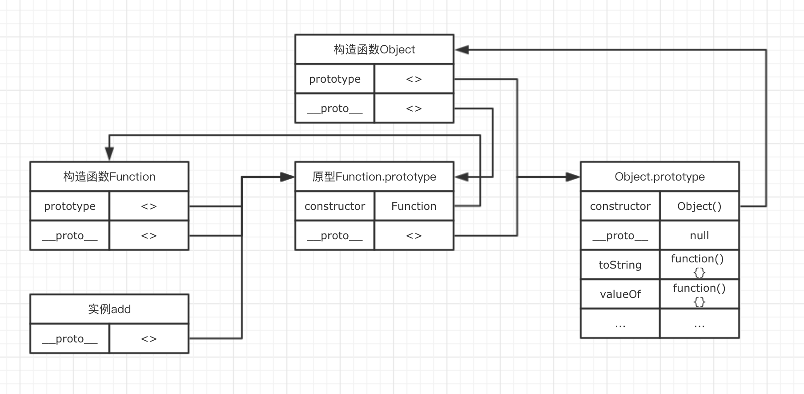
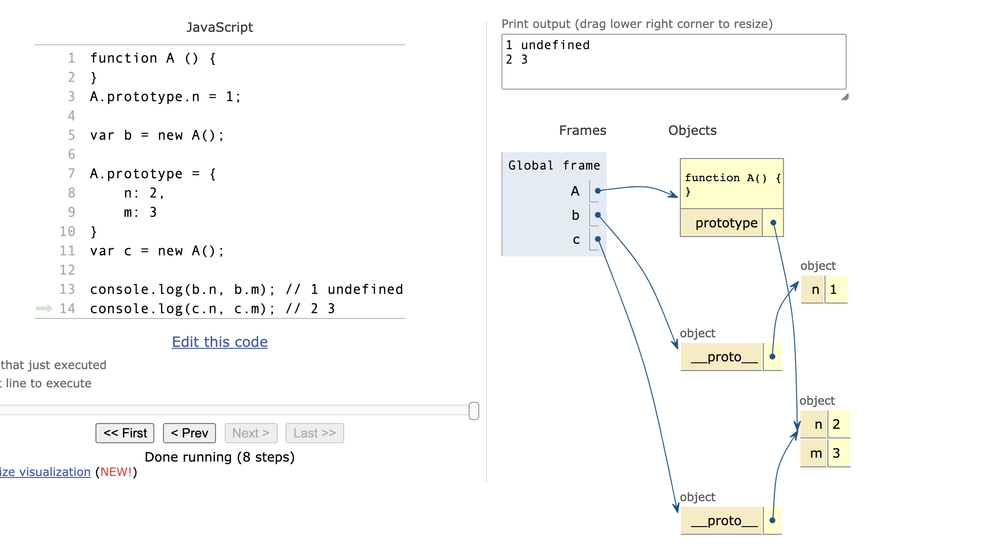

# 原型与原型链

## `__proto__`

+ **对象** 的 **一个属性**
+ 在**函数**中也有
+ **隐式原型**
+ 指向 **构造函数的原型(prototype)** : `obj.__proto__ === obj.constructor.prototype`
+ ES6 中使用 `Object.setPrototypeOf({}, null)` `Object.getPrototypeOf({})` 设置 获取 原型
+ JS内部使用寻找原型链的属性
+ 作用：构成原型链，同样用于实现基于原型的继承

## `prototype`

+ 这是一个**对象**
+ **函数（Function）** 的 **一个属性**
+ **显示原型**
+ 每个函数都有一个`prototype`
+ 指向一个**对象**（原型对象），包含所有实例共享的属性和方法
+ 属性：
  + `constructor`: 包含了一个指针，指回 **原构造函**, 函数原型的构造函数就是它自己，即 `FA.prototype.contructor === FA`;
  + `__proto__`
+ 作用：用来实现基于原型的继承与属性的共享。

## `new`

1. `const dog = {}`
2. `dog.__proto__ = Animal.prototype`
3. `Animal.call(dog)`

## `Object`

```js

    let o = {};

    o.prototype === undefined;
    o.__proto__ === o.constructor.prototype === Object.prototype;
    o.constructor === Object;

    o.prototype = {
        constructor: Object;
    }

    Object.constructor === Function;
    Object.__proto__ === Function.prototype;
    Object.prototype.__proto__ === null;
    Object.prototype.constructor === Object;

    let obj = Object.create(null);
    obj.__proto__ === undefined;
    obj.prototype === undefined;
```

## `Function`

```js

    let f = function(){};
    f.name === 'f';

    f = new Function;
    f.name === 'anonymous';

    f.prototype.constructor === f;
    f.prototype.__proto__ === Object.prototype;
    f.prototype.__proto__ === Function.prototype.__proto__;
    f.constructor === Function;
    f.__proto__ === Function.prototype;

    Function.constructor === Function;
    Function.__proto__ === Function.prototype;
    Function.prototype.constructor === Function;
    Function.prototype.__proto__ === Object.prototype;

    // Function 与 Object 的关联

    Object.constructor === Function;
    Function.__proto__ === Function.constructor.prototype;
    Function.__proto__ === Object.constructor.__proto__ === Function.prototype;
```

## 例子

```js
    function Animal(){};

    const dog = new Animal();

    dog.constructor === Animal;

    dog.__proto__ === Animal.prototype;

    dog.__proto__ === dog.constructor.prototype;

    dog.prototype === undefined;


    Animal.prototype.constructor === Animal;

    Animal.prototype.__proto__ === Object.prototype;

    Animal.constructor === Function;

    Animal.__proto__ === Function.prototype;
```



```js
function A () {
}
A.prototype.n = 1;

var b = new A();

A.prototype = {
    n: 2,
    m: 3
}
var c = new A();

console.log(b.n, b.m); // 1 undefined
console.log(c.n, c.m); // 2 3

```



```js
var F = function(){};
var O = {};
Object.prototype.a = function(){
    console.log('a')
}
Function.prototype.b = function(){
    console.log('b')
}
var f = new F();

F.a(); // a
F.b(); // b
f.a(); // a
f.b(); // f.b is not a function
O.a(); // a
O.b(); // O.b is not a function

// F为函数,它也能访问Object原型上的方法,O为对象,不能访问Function原型上的方法。
// F的原型链为: F => F.__proto__ => Function.prototype => Function.prototype.__proto__ => Object.prototype
// 由于Object.prototype在F的原型链上,所以F能访问Object.prototype上的属性和方法。即: F.a(),F.b()能正常访问。
// O的原型链为: O => O.__proto__ => Object.prototype
// 由于Function.prototype不在O的原型链上,因此O不能访问Function.prototype上的方法,即O.b()抛出错误。
// console.log(f)
// f为F实例 原型连为： f => f.__proto__ => Object

```

```js
console.log(Object instanceof Function); // true

console.log(Function instanceof Object); // true

console.log(Function instanceof Function); // true

```
