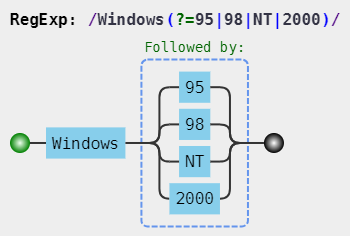
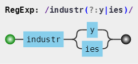
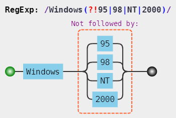
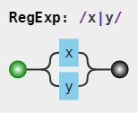

# 正则表达式

## 反向查询与字符匹配

+ 反向引用标识由正则表达式中的匹配组捕获的子字符串。每个反向引用都由一个编号或名称来标识，并通过“\编号”表示法进行引用。

  ```js
    text.replace(/(.{5})/g, '{j|$1}\n');

    '12345678901234567890'.replace(/(.{5})/g, '{j|$1}\n')
      /*
        {j|12345}
        {j|67890}
        {j|12345}
        {j|67890}
      */

    var color = "#990000";
    /#(\d+)/.test(color);
    alert(RegExp.$1); //990000

    /(dog)\1/.test("dogdog") //true
    /(dog)\1\1/.test("dogdogdog") // true
    /(a)\1 (b)\1/.test('aa ba') // true
    /(a)\1 (b)\2/.test('aa bb') // true
    /(a)\2 (b)\1/.test('a ba') // true

    var num = "1234 5678";
    var newNum = num.replace(/(\d{4}) (\d{4})/,"$2 $1");
    alert(newNum) // 5678 1234

    // 非捕获性分组: 分组的左括号的后面紧跟非捕获元字符 ?:、?= 或 ?!
    var color = "#990000";
    /#(?:\d+)/.test(color);
    alert(RegExp.$1); //""

    a.replace(/(张)|(申请)/ig, '<em>$&</em>')  // "<em>张</em>三<em>张</em>的<em>申请</em>"

  ```

+ 非捕获元字符 `?:`、 `?=`、 `?!`
+ 用于匹配单个汉字：`/[\u4e00-\u9fa5]/`
+ 是否是图片： `/.jpg|jpeg|png|bmp|gif$/i.test(value)`
+ `\b`: 单词边界, 指 `[a-zA-Z_0-9]` 之外的字符
+ `\B`: 非单词边界
+ `?=` 
+ `?:` 
+ `?!` 
+ `x|y` 
+ `[xy]` ![[xy]](../assets/regxp/regxp5.png)

## 常用正则

## 邮箱

+ 字母数字下划线： `/^[a-zA-Z0-9_-]+@[a-zA-Z0-9_-]+(\.[a-zA-Z0-9_-]+)+$/`

## 时间格式化

```js
  const time_str = format.replace(/{([ymdhisa])+}/g, (result, key) => {
    const value = formatObj[key]
    // Note: getDay() returns 0 on Sunday
    if (key === 'a') { return ['日', '一', '二', '三', '四', '五', '六'][value ] }
    return value.toString().padStart(2, '0')
  })


  if (/([yY]+)/.test(fmt)) {
    fmt = fmt.replace(RegExp.$1, (`${date.getFullYear()}`).substr(4 - RegExp.$1.length));
  }
  if (/(W+)/.test(fmt)) {
    fmt = fmt.replace(RegExp.$1, ((RegExp.$1.length > 1) ? (RegExp.$1.length > 2 ? '\u661f\u671f' : '\u5468') : '') + week[`${date.getDay()}`]);
  }
  Object.keys(o).forEach(k => {
    if (new RegExp(`(${k})`).test(fmt)) {
      fmt = fmt.replace(RegExp.$1, (RegExp.$1.length === 1) ? (o[k]) : ((`00${o[k]}`).substr((`${o[k]}`).length)));
    }
  });

```

```js


/**
 * Parse the time to string
 * @param {(Object|string|number)} time
 * @param {string} format
 * @returns {string | ''}
 */
export function parseTime(time, format = 'YYYY-MM-DD HH:mm:ss') {
  if (!time) {
    return ''
  }
  let date
  if (typeof time === 'object') {
    date = time
  } else {
    if ((typeof time === 'string')) {
      if ((/^[0-9]+$/.test(time))) {
        // eslint-disable-next-line radix
        time = parseInt(time)
      } else {
        time = time.replace(new RegExp(/-/gm), '/')
      }
    }

    if ((typeof time === 'number') && (time.toString().length === 10)) {
      time *= 1000
    }
    date = new Date(time)
  }
  // eslint-disable-next-line no-restricted-globals
  if (isNaN(date.getTime()) || !(date instanceof Date)) {
    return ''
  }
  const formatObj = {
    Y: date.getFullYear(),
    y: date.getFullYear(),
    M: date.getMonth() + 1,
    D: date.getDate(),
    d: date.getDate(),
    h: date.getHours() % 12 || 12,
    H: date.getHours(),
    m: date.getMinutes(),
    s: date.getSeconds(),
    q: Math.floor((date.getMonth() + 3) / 3),
    S: date.getMilliseconds(),
    w: date.getDay(),
  }
  const week = {
    0: '日',
    1: '一',
    2: '二',
    3: '三',
    4: '四',
    5: '五',
    6: '六',
  }
  return format.replace(new RegExp(`([${Object.keys(formatObj)
    .join('')}])+`, 'g'), (
    result, key,
  ) => {
    const value = formatObj[key]
    const tl = result.length
    const vl = value.toString().length
    if (key === 'w') {
      return (tl > vl ? '星期' : '周') + week[value]
    }
    if (tl >= vl) {
      return value.toString()
        .padStart(tl, '0')
    } else {
      return value.toString()
    }
  })
}

/**
 * @param {number} time
 * @param {string} option
 * @returns {string}
 */
export function formatTime(time, option) {
  if ((`${ time}`).length === 10) {
    // eslint-disable-next-line radix
    time = parseInt(time) * 1000
  } else {
    time = +time
  }
  const d = new Date(time)
  const now = Date.now()

  const diff = (now - d) / 1000

  if (diff < 30) {
    return '刚刚'
  } else if (diff < 3600) {
    // less 1 hour
    return `${Math.ceil(diff / 60) }分钟前`
  } else if (diff < 3600 * 24) {
    return `${Math.ceil(diff / 3600) }小时前`
  } else if (diff < 3600 * 24 * 2) {
    return '1天前'
  }
  if (option) {
    return parseTime(time, option)
  } else {
    return (
      `${d.getMonth()
      + 1
      }月${
      d.getDate()
      }日${
      d.getHours()
      }时${
      d.getMinutes()
      }分`
    )
  }
}


```

## url 参数

```js

/**
 * 获取URL指定参数
 * @param {string?} [name] 参数名
 * @param {string?} [url] 要匹配的 url 默认 当前 url
 * @returns {string|boolean}
 */
export function GetQueryString(name, url = window.location.href) {
  const reg = new RegExp(`${name ? `[&?](${name}` : '([^?&=/#]+'})=([^?&=/#]*)`, 'g')
  const obj = {}
  url.replace(reg, (rs, $1, $2) => {
    const key = decodeURIComponent($1)
    $2 && (obj[key] = decodeURIComponent($2))
    return rs
  })
  return name ? obj[name] : obj
}

```
