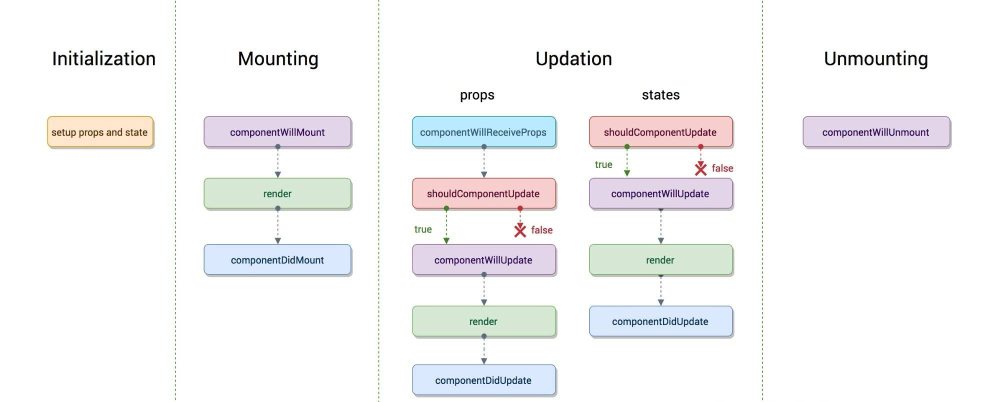
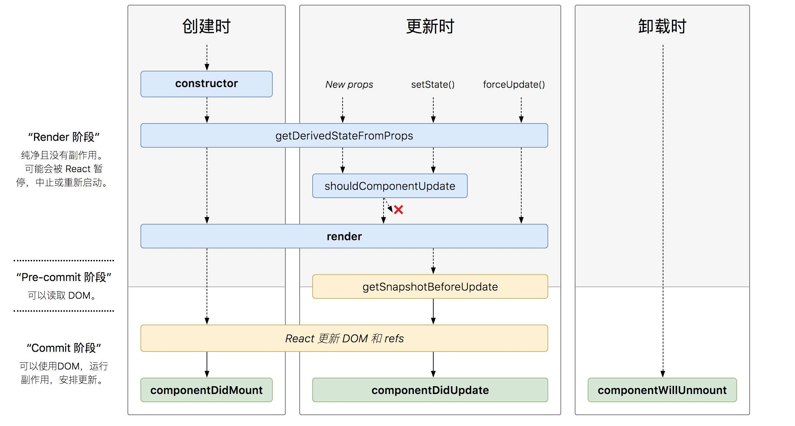
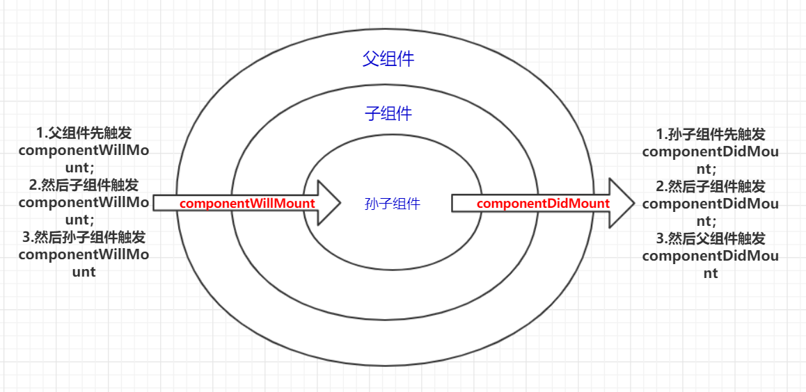

# React

> [create-react-app](https://www.html.cn/create-react-app/docs/getting-started/)  
> [react](https://zh-hans.reactjs.org/)  
> [redux](https://redux.js.org/)  [redux中文文档](https://www.redux.org.cn/)  
> [reactnative](https://reactnative.dev/)  
> [react-router](http://react-guide.github.io/react-router-cn/docs/Introduction.html)  

## 组件

+ react 组件必须首字母大写
  + 组件大小写是为了区别通过HTML标签定义的JSX，大写的组件在定义时，其type会是React.Component类型，若是将组件名写成了小写，则定义时会将其当作HTML标签定义进行
+ 组件声明
  + 函数式定义的无状态组件
    + 一个函数式组件不能在另一个函数式组件内声明
  + ~~es5原生方式React.createClass定义的组件~~
  + es6形式的extends React.Component定义的组件
+ 代码中使用 emoji： 用 span 标签，并设置 role='img' `aria-abel` 或 `aria-labelledby`
  + `<span role="img" aria-label="happy">😁</span>`

## 组件传参

+ props
+ 回调函数
+ 观察者模式
+ context
+ react-redux

## JSX

+ 用户定义的组件必须以大写字母开头
+ `<input type="text" value="haha">` 的 react 中 不能编辑 但在原生 html 中 可编辑， 如 `value={undefined}` 则可编辑
+ `class` 变成 `className`
+ `for` 变成 `htmlFor`
+ `tableindex` 变成 `tableIndex`
+ `style` 必须是 `Object` 对象形式 `style={ {textAlign: 'left'} }`
+ 可以在 `for if` 等语句中使用 `jsx`; 但不可以在 `jsx` 中使用 `for if`, 可以用 `?:` `&&`

## API

### props

+ `static defaultProps`: 设置默认 `props`
  + 如同 vue 中的 props 里的 `default` 参数
+ `props.children`: 组件的所有子节点
  + 类似于 vue 中的 `default slot`
  + react 中没有 插槽概念，但 可以将任何东西作为 props 进行传递。
  + 当不插入内容或内容为换行符时，props.children为undefined
  + 当插入多个内容时，props.children为Array（多个文本视为一个内容）
  + 当插入一个内容时，props.children为插入值
  + 父组件的属性传给所有子组件就要用到 `React.Children`

### state

+ `setState`
  + 调用此方法就会触发更新阶段钩子函数
  + 可以设置未在 `state` 中初始化的字段，添加新的字段
  + 在周期函数中的使用
    + 在 `constructor`使用无效
    + 在 `static getDerivedStateFromProps` 不能调用
    + 在 ~~`componentWillMount`~~ 中使用有效，但不一定会引起组件重新渲染
    + 在 ~~`componentWillReceiveProps`~~ 中可以使用
    + 不能在 `shouldComponentUpdate` ~~`componentWillUpdate`~~ 中调用，会引起死循环
    + 在 `render` 中使用会陷入死循环
    + 在 `componentDidUpdate` 中使用要特别注意判断，否则会陷入死循环
    + 在 `componentDidMount` 中可以使用，用于接口数据获取

### React.Fragment

+ `<React.Fragment>...</React.Fragment>`
  + 不会渲染成标签
  + 可以有 key属性，也是目前唯一的属性
+ 短语法： `<>...</>`
  + 不支持 key 与其它属性
+ 类似于 vue 中的 `template`

### React.lazy

> `React.lazy` 和 `Suspense` 技术还不支持服务端渲染

+ 像渲染常规组件一样处理动态引入（的组件)
+ `const OtherComponent = React.lazy(() => import('./OtherComponent'));`

  ```js
  import React, { Suspense } from 'react';

  const OtherComponent = React.lazy(() => import('./OtherComponent'));
  const AnotherComponent = React.lazy(() => import('./AnotherComponent'));

  function MyComponent() {
    return (
      <div>
        <Suspense fallback={<div>Loading...</div>}>
          <section>
            <OtherComponent />
            <AnotherComponent />
          </section>
        </Suspense>
      </div>
    );
  }

  ```

### Suspense

### Context

+ `React.createContext(defaultValue)`
+ `Context.Provider`
+ `Class.contextType`
  + `static contextType = MyContext`
+ `Context.Consumer`
+ `Context.displayName`

> [全面了解 React 新功能: Suspense 和 Hooks](https://segmentfault.com/a/1190000017483690)

### static getDerivedStateFromError()

### Ref

+ React.createRef
  + v16 版本之后新增，取值在 `this.textInput.current`
  + v16 版本之前，使用函数 `ref={ele => this.textInput = ele}`
  + 不能在函数组件上使用 ref 属性，因为函数组件没有实例
+ React.useRef
  + 仅限于在函数组件内使用
  + useRef 返回的 ref 对象在组件的整个生命周期内保持不变
+ React.forwardRef
  + v16 新增，转发 ref


### React.PureComponent

+ [文档](https://zh-hans.reactjs.org/docs/react-api.html#reactpurecomponent)
+ `React.PureComponent` 与 `React.Component` 很相似。两者的区别在于 `React.Component` 并未实现 `shouldComponentUpdate()`，而 `React.PureComponent` 中以浅层对比 `prop` 和 `state` 的方式来实现了该函数。

### ReactDOM.createPortal

### React.Profiler

### React.createElement

### PropTypes

+ [文档](https://zh-hans.reactjs.org/docs/typechecking-with-proptypes.html#gatsby-focus-wrapper)
+ 类型检测，类似 vue 中 props 类型检查
+ 使用 `TS` 可以省略此步骤
+ 自 React v15.5 起，`React.PropTypes` 已移入另一个包中。请使用 `prop-types` 库代替

## 生命周期

> `componentWillMount` `componentWillReceiveProps` `componentWillUpdate`周期会在 v17 版本之后保留删除，`UNSAFE_*` 函数会保留  
> 因 `React Fiber`, 周期改变

+ [生命周期图谱](https://projects.wojtekmaj.pl/react-lifecycle-methods-diagram/)
+ 旧版生命周期(v16.0前)
  + 
  + 
+ 新版生命周期(v16.3后)
  + 
  + 

### 初始化阶段

+ `constructor(props: Readonly<P>, context?: any)`
  + 只调用一次 `super` 必须在使用 `this` 语句之前调用
  + 参数: `props`
  + 作用
    + 初始化 `state`
    + ...

### 挂载阶段

+ ~~`componentWillMount()/UNSAFE_componentWillMount()?:void`~~
  + 组件挂载之前调用，只调用一次 使用 `contructor` 代替
  + 此时调用 `this.setState` 不一定会引起组件重新渲染
  + 在Fiber之后， 由于任务可中断，willMount可能会被执行多次
+ `static getDerivedStateFromProps(nextProps, prevState):Partial<prevState> | null`
+ `render(): ReactNode`
  + 用来渲染DOM
  + 必须是纯函数
  + 返回 `JSX.Element`
  + 不要在 `render` 里面修改 `state`，会触发死循环导致栈溢出
+ `componentDidMount?(): void`
  + 组件挂载后调用， 只调用一次
  + 可以在这里使用 refs 获取真实 DOM
  + 可在此处发起 异步请求 并进行 `setSate`
  + 依赖 DOM 初始化 添加事件监听

### 更新阶段

> `setState` 引起的 `state` 更新  
> 父组件能过 `setState` 引起的 `props` 变化时，触发更新阶段  
> 父组件 `render` 触发时， 触发更新子组件更新阶段
> 更新后的 state 和 props 相对之前的无论是否变化，都会引起组件重新 render

+ ~~`componentWillReceiveProps()/UNSAFE_componentWillReceiveProps(nextProps, nextContext)`~~
  + `props` 变化与 父组件重新渲染时，都会触发
  + `nextProps` 变化之后的 `props` 参数
    + 在该函数内使用 `this.props` 返回的是未更新前的 `props`
    + 可以在此函数内使用 `setState`
+ `static getDerivedStateFromProps(nextProps, prevState):Partial<prevState> | null`
  + 每次渲染之前都会调用, 不管造成重新渲染的原因是什么，不管初始挂载还是后面的更新都会调用
  + 需要在该方法中返回一个对象或null
    + 如果返回的是对象，则会更新 state，返回结果会被送给setState
    + 如果返回的是null，则表示不更新。
  + 使用该方法的时候需要初始化 `state` ，否则在控制台中会出现警告信息，不能在该方法内部，调用 `this.state`
  + 无法在此函数内使用 `this`, 这里的 `this` 指向 `undefined`
  + 将父组件传递过来的 props 映射 到子组件的 state 上面，这样组件内部就不用再通过 this.props.xxx 获取属性值了，统一通过 this.state.xxx 获取. 映射就相当于拷贝了一份父组件传过来的 props ，作为子组件自己的状态。注意：子组件通过 setState 更新自身状态时，不会改变父组件的 props
  + 配合 componentDidUpdate，可以覆盖 componentWillReceiveProps 的所有用法
+ `shouldComponentUpdate(nextProps, nextState, nextConext):boolean`
  + 在首次渲染时或者 `forceUpdate()` 时不会触发
  + 每次调用 `setState` 都会触发，用于判断是否要重新渲染组件
  + 能过比较 `nextProps` `nextState` 及当前组件的 `this.props` `this.state` 的状态来判断是否重新渲染
  + 如果返回 `false` 后续周期函数不再触发
    + React 可能将shouldComponentUpdate视做提示而不是严格的根据它的返回结果决定是否执行，也就是说可能出现shouldComponentUpdate返回false，但是还是发生重新渲染
  + 不能使用 `setState`, 会死循环
  + 一般能过此函数进行性能优化
    + 父组件 `render` 会触发 子级组件 更新阶段
    + 可在些函数中中止不必要的更新，后台的 虚拟 DOM diff ...
+ ~~`componentWillUpdate()/UNSAFE_componentWillUpdate(nextProps, nextState, nextContext)`~~
  + 组件即将被更新时触发
  + `shouldComponentUpdate` 返回 `true` 或 调用 `forceUpdate` 之后调用
  + 不能在该钩子中使用 `setState`
+ `render()`
+ `getSnapshotBeforeUpdate(prevProps, prevState): any | null`
  + 被调用于 render 之后、更新 DOM 和 refs 之前
  + 返回值称为一个快照（snapshot），如果不需要 snapshot，则必须显示的返回 `null`
  + 返回值将作为 `componentDidUpdate()` 的第三个参数使用。所以这个函数必须要配合 `componentDidUpdate`() 一起使用, 可以覆盖 `componentWillUpdate` 的所有用法
    + 在 `getSnapShotBeforeUpdate` 中获取滚动位置，然后作为参数传给 `componentDidUpdate`，就可以直接在渲染真实的 DOM 时就滚动到需要的位置。
+ `componentDidUpdate(prevProps, prevState, snapShot)`
  + 该方法不会再组件初始化时触发
  + 组件更新之后调用
  + `props` `state` 中此钩子函数内已更改成最新, `this.props` 访问到的是新的 `props`
  + 钩子内 `setState` 有可能会触发重复渲染，需要自行判断，否则会进入死循环

### 卸载阶段

+ `componentWillUnmount()`
  + 组件卸载前调用
  + 进行一些清理工作
    + 去除定时器
    + 取消 Redux 订阅事件
    + 清除 componentDidMount 中手动创建的 DOM 元素
    + 去除可能的内存泄露
    + ...

### 错误捕获

+ `componentDidCatch(error: Error, errorInfo: React.ErrorInfo)`
  + 任何子组件在渲染期间，生命周期方法中或者构造函数 `constructor` 发生错误时调用
  + 错误边界不会捕获下面的错误
    + 事件处理 (Event handlers) （因为事件处理不发生在 React 渲染时，报错不影响渲染)
    + 异步代码 (Asynchronous code) (例如：setTimeout or requestAnimationFrame callbacks)
    + 服务端渲染 (Server side rendering)
    + 错误边界本身(而不是子组件)抛出的错误

### 使用

> [你真的了解 React 生命周期吗](https://juejin.im/post/5df648836fb9a016526eba01)  
> [你可能不需要使用派生 state](https://zh-hans.reactjs.org/blog/2018/06/07/you-probably-dont-need-derived-state.html#preferred-solutions)

+ 发起 ajax 请求，获取数据 `componentDidMount`
+ 使用 refs 获取真实 DOM `componentDidMount`
+ 将 `props` 变成 内部 `state`: `static getDerivedStateFromProps`
+ 控制组件是否更新 `shouldComponentUpdate` `return true | false`
+ 当外部的 props 改变时，如何再次执行请求数据、更改状态等操作
  + 使用 ~~`componentWillReceiveProps`~~
  + 使用 `static getDerivedStateFromProps` + `componentDidUpdate` 加载数据

    ```js
      class ExampleComponent extends React.Component {
        state = {
          externalData: null,
        };

        static getDerivedStateFromProps(nextProps, prevState) {
          if (nextProps.id !== prevState.prevId) {
            return {
              externalData: null,
              prevId: nextProps.id,
            };
          }
          return null;
        }

        componentDidMount() {
          this._loadAsyncData(this.props.id);
        }

        // 借助 componentDidUpdate
        componentDidUpdate(prevProps, prevState) {
          if (this.state.externalData === null) {
            this._loadAsyncData(this.props.id);
          }
        }

        componentWillUnmount() {
          if (this._asyncRequest) {
            this._asyncRequest.cancel();
          }
        }

        render() {
          if (this.state.externalData === null) {
            // Render loading state ...
          } else {
            // Render real UI ...
          }
        }

        _loadAsyncData(id) {
          this._asyncRequest = asyncLoadData(id).then(
            externalData => {
              this._asyncRequest = null;
              this.setState({externalData});
            }
          );
        }
      }
    ```

  + 使用 `static getDerivedStateFromProps` 更改状态
  + 只用 `componentDidUpdate` 的写法

    ```js
      componentDidUpdate() {
        if (this.props.age !== this.state.age) {
          console.log("componentDidUpdate", this.props.age);
          this.setState({ age: this.props.age });
        }
      }
    ```
