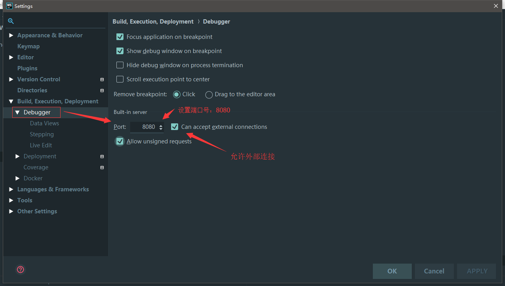
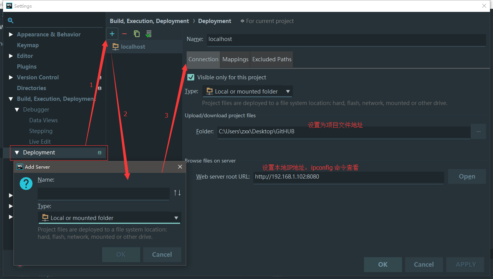

# webStorm 使用笔记

## 目录

- [在 webstrom 中连接 github](#在webstrom中连接github)
- [在 webstrom 中安装配置 autoprefixer](#在webstrom中安装配置autoprefixer)

---

## 在 webstrom 中连接 github

- 设置

1. 设置 --> Version Control --> GitHub
2. 填入 Host: github.com Login: 用户名 Password: 密码
3. 点击 Test 测试是否连通 成功 success
4. 设置 --> Version Control --> Git
5. 安装 git 测试是否安装 成功 success

- 对本机授权

1. 进入目录: `cd ~/.ssh`
2. 生成新的 ssh `$ ssh-keygen -t rsa -C "your_email@youremail.com"` 生成的 ssh 在 `.ssh\id_rsa.pub` 中.
3. 在 github setting --> SSH Keys 中添加新创建的 ssh

- 使用 git

1. VCS --> Checkout from Version Control --> gitHub

---

## 在 webstrom 中安装配置 autoprefixer

- 安装
  1. 安装 `Autoprefixer` : `npm install autoprefixer -g`
  2. 安装 `postcss-cli` : `npm install postcss-cli -g`
  3. 软件配置 `Webstorm` 中的 `External Tools`:
     `Preferences -> Tools -> External Tools`
  4. webstorm External Tools 配置
     打开 webstorm->File->搜索 External Tools->点击‘+’，设置 Edit Tool
     Program： 找到 AppData 下的文件 postcss.cmd
     C:\Users\Administrator\AppData\Roaming\npm\postcss.cmd
     Parameters：-u autoprefixer -o outputFile inputFile
     -u autoprefixer -o $FileDir$/$FileName$ $FileDir$/$FileName$
     Working directory：文件项目目录即可
     $FileDir$
  5. 运行
     在输出文件中点击右键->autoprefixer ,即可生成新增兼容前缀的文件

## Webstrom 常用快捷键与功能

### 快捷键

- `Ctrl + Alt + S` : 打开配置
- `Shift + Shift` : Search everywhere
- `Alt + 1` : 显示项目目录结
- `Alt + 2` : 显示收藏
- `Alt + 6` : 快速定位所有的 `TODO` 注释
- `Alt + 7 | Ctrl + F12` : 显示当前文件结构 左侧显示 | 弹窗显示
- `Alt + J` : 选择多个光标处单词，并一同编辑
- `Alt + Q` : 查看上下文信息
- `Alt + F7` : 强大的搜索光标处单词的功能
- `Ctrl + B | Navigate > Declaration` : 定位到光标处类名的位置（可直接跳转到 css 中类位置）`
- `Ctrl + Tab`: 视图切换
- `Ctrl + E` : 最近打开文件
- `Ctrl + R` : 文件内代码替换
- `Ctrl + Shift + R` : 目录内代码批量替换
- `Ctrl + Shift + F` : 目录内代码批量查找
- `Ctrl + /` : 行注释
- `Ctrl + Shift + /` : 块注释
- `Ctrl + Ctrl(按住不放) + 方向键`: 按两次 `Ctrl` 键不放，之后再按 `方向键` 同时选种并编辑多行， 同样的还有 `Alt + 鼠标左键点击` `Alt + 鼠标左键拖拽`
- `F11`: 在光标行添加或删除 Bookmark
- `Alt + Shift + F`: 将当前文件添加到收藏夹
- `/** + TAB`: 添加函数说明

## 配置

- `Settings > Editor > File Types` : 配置文件语法高亮，设置不校验目录如 `node_modules` `.vscode`

- 配置局域网服务器环境：
  - 如果这样做，会很卡，一般不用；
  - 设置调试模式 `Debugger`，配置端口号 `8080` , 允许外部访问；
    
  - 设置部署模式 `Deployment`，添加服务器， 输入 Name, `Type` 选择 `Local or mounted folder`;设置`connention` , `upload/download project files` 服务器跟目录，`web server root URL` 服务器路径
    

- 增加 webstrom 内存，`D:\Program Files\JetBrains\WebStorm 2017.3.3\bin` 修改里面的文件 `webstorm64.exe.vmoptions` `-Xms512m -Xmx2048m`

- 设置新建文件模板：`File and Code Templates`

- 设置代码补全模板：`Postfix Completion`

- 设置注释模板： `Live Templates`

## mac 卸载删除文件

- `/Users/xuan/Library/Application Support/JetBrains`
- `/Users/xuan/Library/Caches/JetBrains`
- `/Users/xuan/Library/Preferences/jetbrains.jetprofile.asset.plist`
- `/Users/xuan/Library/Preferences/jetbrains.webstorm.d9f3b04.plist`
- `/Users/xuan/Library/Logs/JetBrains`

## 插件

- `Chinese`
- `IdeaVim`
- `Translation`
- `deno`
- `One Dark theme`
- `Atom Material Icons`
- `.env files support`
- `.ignore`
- `GitToolBox`
- `PostCss`
- `Rainbow Brackets`
- `Import Cost`
- `Foldable ProjectView`
- `JetBrains Academy`
- `Rust`
- `Toml`
