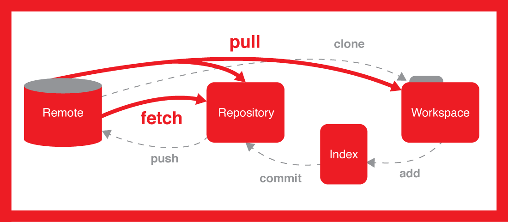

# git 使用

## 配置
+ `git clone --depth=1 https://github.com/*****` :  克隆时只克隆最近的文件，避免 `.git` 文件过大时克隆过慢；
+ 全局配置
    ```
    git config --global user.name "your name" 　// 配置用户名与密码
    git config --global user.email "your eml"

    // 记住密码
    git config --global credential.helper store // 不用每次输入密码 长期
    git config --global credential.helper cache // 十五分钟
    git config credential.helper 'cache --timeout=3600' // 自定义时间 单位 s
    ```
+ `HEAD` : 当前版本； `HEAD^`: 上一个版本; `HEAD^^`： 上上个版本； `HEAD~100`：上100个版本
+ 工作区 -- 暂存区 -- 版本库
+ 已跟踪 -- 未跟踪
+ 未修改 -- 已修改 -- 已存入暂存区

## 工作流
+ 
+ git 常用命令 
+ 

##  常用命令与工作流；


+ 新建
   ```
      git init // 新建
      // 状态查看
      git status
      git show
   ```
     
+ 获取
    ``` 
      // fetch
      git fetch origin // 取回所有
      git fetch origin master // 取回 master 分支
      
      // pull = fetch + merge
      git pull <远程主机名> <远程分支名>:<本地分支名> 
      // 当前在 master 分支下
      git pull == git fetch origin + git merge origin/master 
      // 当前在 dev 分支下
      git pull == git fetch origin + git merge origin/dev  
      // 如果有多个 remote 指定 remote
      git pull origin next:master // 取回origin主机的next分支，与本地的master分支合并
      git pull origin next //远程分支是与当前分支合并
    ```

+ 提交
    ```
      git add .
      git add a.txt // 存入暂存区
      git commit -m "update" // 将暂分区
      git commit -a -m "update" a.txt // 同上两步
       // 推送
          git push -u orgin master // 第一次
          git push origin master // 将本地仓库提交到远程 orgin 仓库 master 分支中
          git push gitee master
          git push origin dev
          git push origin test:master   // 提交本地test分支作为远程的master分支
          git push origin test:test     // 提交本地test分支作为远程的test分支
          git push --all origin
          git push --force origin 
    ```
    
+ 撤消
    ```
     // 显示提交历史
     git log
     git log --pretty=oneline
     git commit --amend //修改最后一次提交
     git checkout -- readme.txt // 撤消工作区的更改
     git reset HEAD readme.txt // 撤消 git add 操作
     git reflog // 命令历史
     git reset --hard HEAD^
     git reset --hard HEAD^^
     git reset --hard HEAD~100
     git reset --hard 053a
     git revert <commit> //撤消指定的提交
     
     git reset HEAD^ // 恢复到上一个版本， 只是恢复到了暂存区
     git checkout -- test.txt // 将删除的test.txt 从暂存区恢复到工作区
     
    ```
    
+ 删除
    ```
     // 不想文件被跟踪
     git rm --cached readme1.txt    删除readme1.txt的跟踪，并保留在本地。
     git rm --f readme1.txt    删除readme1.txt的跟踪，并且删除本地文件。
    ```     
     
+ 分支
    ```
        // 创建并切换到新的分支
        git checkout -b newbranch
        git checkout -b dev origin/dev
        git branch --set-upstream-to=origin/dev dev
        git branch --set-upstream master origin/next
        git branch newbranch
        git checkout newbranch

        // 查看当前分支
        git branch

        // 合并分支
        git checkout master
        git merge newbranch
        git merge --no-ff -m "merge with no-ff" dev
        // 删除分支
        git branch -d newbranch
        git branch -D newbranch
    ```
+ 创建一个新的空白分支
    ```
        git checkout --orphan emptybranch // 新的空白分支
        git rm -rf . // 原分支中的内容会自动添加, 移除原分支文件
        // 新建一个文件
        git add new.txt
        git commit -a -m 'new text'
        
        git merge emptybranch --allow-unrelated-histories // 新空白分支无共同父祖先，要添加 allow* 参数
        git pull origin master --allow-unrelated-histories
    ```
+ 合并与变基
    ``` 
        // merge
        git checkout master // 当前分支变为 master 
        git merge dev // 把 dev 分支合并到 master 分支上
        git merge a b // 把 a b 分支合并到当前分支 master 上并提交
        git merge --no-commit dev 
        
        // rebase
        git checkout dev // 进入分支
        git rebase master // 将当前分支 dev 上的更改 合并到 master 分支上
        git checkout master // 回去 master 分支上
        git merge dev // 将 dev 分支 合并到 当前分支上 master 上
        
        git rebase --continue // 当有冲突时，解决冲突后继续 rebase
        git rebase --abort // 中止 rebase
    ```

+ 远程库
    ```
    // 查看远程库信息
    git remote
    git remote -v
    
    // 添加远程库
    git remote add gitee https://*****.git
    
    // 移除库
    git remote rm origin
   
    // 重命名
    git remote rename <原主机名> <新主机名>
    ```
+ tag
    ```
    git tag
    git tag v1.0
    git tag v2.0 546af
    git tag -a v2.0 -m 'vetsion 2.0 release' 546af

    git show v1.0

    git tag -d v1.0.3

    git push origin v1.0
    git push origin --tags

    git tag -d v0.9
    git push origin :refs/tags/v0.8
    ```

+ 比较
    ``` 
     // 查看工作区和版本库里面最新版本的区别
     git diff HEAD -- readme.txt
    ```
    
+ bug 处理
    ```
    git stash // 将工作区与暂存区保存起来
    git stash pop // 返回最新工作进度
    git stash list // 保存进度列表
    git stash pop --index
    git stash pop stash@{1}
    git stash apply

    git stash drop stash@{1}
    git stash clear
    ```
    ```
    // 一个工作流
    git stash
    git checkout master
    git checkout -b issue-101
    vim read.txt
    git add read.txt
    git commit -m 'bug fixed'
    git checkout master
    git merge --no-ff -m 'merge bug' issue-101
    git branch -d issue-101
    git checkout dev
    git stash list
    git stash pop
    ```